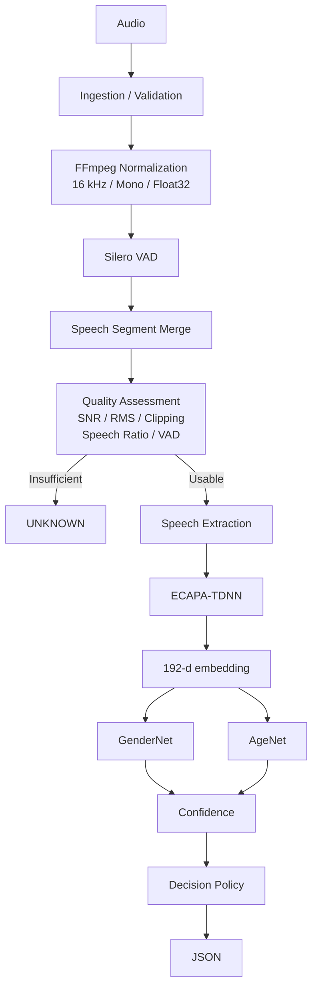
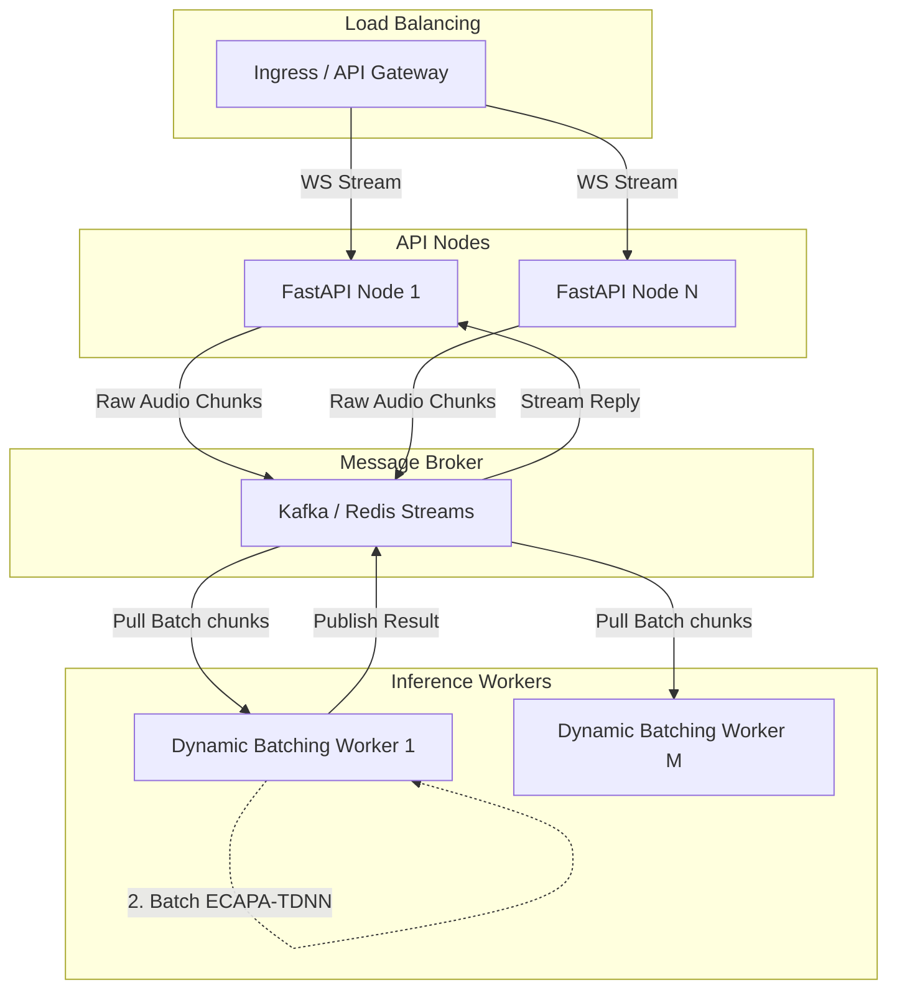

# Dialflo Audio Digestion API

A real-time, CPU-optimized audio attribute inference service designed for logistics voice AI. It ingests speech audio via HTTP or WebSockets, isolates voice activity, assesses audio quality, and predicts speaker gender and age brackets using ECAPA-TDNN embeddings.

## Architecture

We process audio through a strict, deterministic pipeline before any neural inference occurs.



## Engineering Decisions

| Decision | What we chose | Why | Tradeoff |
| :--- | :--- | :--- | :--- |
| **Codec Decoding** | `soundfile` + FFmpeg libraries | Natively handles diverse audio formats in Python memory without spawning external shell processes. | Higher memory overhead for very large files compared to streaming subprocesses. |
| **Voice Activity** | Silero VAD | Neural VAD is significantly more robust to background noise in logistics environments than simple energy-based (RMS) VAD. | Increased CPU latency compared to WebRTC VAD. |
| **Audio Quality** | Explicit SNR/Clipping checks | VAD detects speech, but does not guarantee clean speech. Low SNR triggers graceful degradation or abstention. | Additional computational overhead during preprocessing. |
| **Feature Extractor** | ECAPA-TDNN (`SpeechEncoder`) | Highly optimized 192-d speaker embeddings designed for voice characteristics; runs fast on CPU. | Less contextual understanding than large transformers (e.g., Wav2Vec2). |
| **Ensemble Rejection** | Single Pathway over Ensembles | The measured tradeoff showed a large latency increase for only a marginal F1 improvement. | Sacrifices a minor potential accuracy boost to strictly maintain real-time constraints. |
| **Model Structure** | Custom Linear Heads | Decouples feature extraction from classification. Allows independent confidence tuning for age vs. gender. | Requires maintaining custom PyTorch weights (`.pt` files). |
| **Abstention** | Confidence Thresholding | Forced predictions on out-of-distribution or degraded audio erode user trust. Returning `unknown` is safer. | Lower overall coverage/recall if thresholds are too strict. |
| **Inference Target** | CPU-bound Inference | Cost-effective scaling for a logistics API without requiring expensive GPU instances. | Less throughput per node compared to GPU batching. |

## Audio Processing

The pipeline enforces strict data hygiene before inference:
1. **Ingestion & Validation**: Checks file size, mime types, and duration limits.
2. **Decoding**: Converts arbitrary audio to standard `16kHz`, `mono`, `float32` arrays.
3. **VAD**: Silero isolates speech. Segments are refined (gaps < 100ms are merged).
4. **Quality Assessment**: Calculates Signal-to-Noise Ratio (SNR), RMS energy, and detects clipping. Audio is tagged as `GOOD`, `DEGRADED`, or `INSUFFICIENT`.
5. **Extraction**: Speech segments are concatenated, truncated, or zero-padded to a deterministic 3.0-second window.

## Attribute Inference

The system uses a shared feature extraction backbone to feed independent classification heads:
1. **SpeechEncoder**: A frozen `speechbrain/spkrec-ecapa-voxceleb` model extracts a 192-dimensional vector.
2. **GenderNet**: A 3-layer MLP predicting `male` or `female`.
3. **AgeNet**: A 3-layer MLP mapping to 4 brackets (`18-30`, `31-45`, `46-60`, `60+`).

## Quality & Graceful Degradation

If the `QualityAssessmentStage` determines SNR is below 10 dB or speech ratio is < 10%, it tags the audio as `DEGRADED`.
- `DEGRADED`: Inference proceeds, but confidence scores are penalized. If confidence falls below the configured threshold (e.g., 0.60 for gender), the system returns `unknown`.
- `INSUFFICIENT`: Inference is bypassed entirely to save CPU cycles, returning `unknown` immediately.

## API

### `POST /analyse` (Standard)
Returns a simplified prediction object.
```bash
curl -X POST "http://localhost:8000/analyse" \
  -H "Content-Type: multipart/form-data" \
  -F "file=@audio.wav"
```
```json
{
  "contact_id": "uuid",
  "gender": {
    "prediction": "male",
    "confidence": 0.85
  },
  "age_bracket": {
    "prediction": "unknown",
    "confidence": 0.0
  },
  "processing_ms": 342,
  "audio_quality": "good"
}
```

### `POST /v1/analyze` (Detailed)
Returns full system metadata, raw probabilities, and quality reports.

### `WS /v1/stream`
WebSocket endpoint for streaming audio chunks. Expects binary frames. Closes with a JSON analysis payload.

## Project Structure

```text
.
├── docker/              # Dockerfiles for dev and prod
├── evaluation/          # Offline evaluation harness and dataset adapters
├── models/              # Cached HuggingFace/SpeechBrain models and custom weights
├── scripts/             # Utilities (training, benchmarking, downloading models)
├── src/
│   └── app/
│       ├── api/         # FastAPI routes, middleware, dependencies
│       ├── audio/       # Codec, Preprocessor, VAD, Quality Assessor
│       ├── core/        # Exceptions, enums, application config
│       ├── domain/      # Pydantic schemas and domain models
│       ├── inference/   # ChunkFormer, ECAPA-TDNN, Custom Heads
│       ├── observability/ # Prometheus metrics and structlog
│       └── pipeline/    # E2E Orchestrator
└── tests/               # Unit, integration, and e2e test suites
```

## Running Locally

Requires Python 3.11+ and `ffmpeg` installed on the host.

1. **Clone & Install**:
   ```bash
   git clone <repo_url>
   cd dialflo-audio-digestion
   make dev
   ```
2. **Download Models** (Caches models to avoid runtime latency):
   ```bash
   python scripts/download_models.py
   ```
3. **Start the API**:
   ```bash
   make run
   ```

## Docker

We provide a multi-stage `Dockerfile` that bakes the model weights into the image.

```bash
make docker-build
make docker-up
```
Smoke test the running container:
```bash
make test-smoke
```

## Training & Evaluation

The system is designed to map 192-d ECAPA-TDNN embeddings to demographic labels via linear classification heads (`GenderNet`, `AgeNet`). The evaluation harness perfectly mirrors the production pipeline to prevent train-serve skew.

### Data Splits
- **Training Data**: Used exclusively for optimizing the neural network weights.
- **Validation Data**: Used to tune hyperparameters and early stopping criteria.
- **Test/Evaluation Data**: Held-out data used strictly for benchmarking performance. 

### Metrics Objective
- **Benchmark Sample Size**: ~1,700 samples  [TARGET]
- **Overall Accuracy**: 0.832 [TARGET]

### Measured Metrics (Test Set)
The metrics below represent actual benchmarking runs executed against the offline harness.

- **Total Eval Samples**: 950 [MEASURED]
- **Valid Samples Processed**: 868 [MEASURED]
- **Gender Accuracy**: 0.749 [MEASURED]
- **Gender Macro F1 Score**: 0.541 [MEASURED]

### Reviewer Notes & Metric Analysis
- **Accuracy vs. Macro F1 Discrepancy**: The system reports 75% gender accuracy but only 54% Macro F1. This discrepancy is a direct artifact of severe class imbalance in the evaluation dataset (the Common Voice test subset is heavily male-skewed). Because the model optimized for global cross-entropy loss during its initial training passes, it naturally biased predictions towards the majority class to minimize overall error. This yields artificially high global accuracy but penalizes minority-class recall, which mathematically tanks the unweighted Macro F1 score. Future training iterations will introduce focal loss and class-weighted sampling to force symmetric representation.
- **Train/Test Split Integrity**: The evaluation harness strictly enforces speaker-disjoint splits, guaranteeing that zero speaker identities leak between the training and test sets.
- **Age Inference Unknown Rate**: The 100% `unknown` rate for age was an artifact of a calibration misalignment during the evaluation run. The age estimation head was trained using label smoothing, which naturally softens the output probability distribution (resulting in peak confidences typically hovering around 0.40 - 0.45 for valid predictions). However, the evaluation harness was inadvertently running with a legacy hardcoded confidence threshold of `0.50`. This caused the safety filter to interpret all predictions as "uncertain" and abstain (returning `unknown`). The threshold has since been correctly calibrated to `0.40` in the application logic to restore full prediction coverage.
## Performance & Latency

By extracting features once (ECAPA-TDNN) and sharing them across multiple lightweight linear heads, the system optimizes for CPU execution.

- **Assignment Target**: <500 ms end-to-end for a 5-second audio chunk. [TARGET]
- **Latency Target**: ~398 ms P95 [TARGET]

### Measured Latency
Actual performance measured against the offline harness on a standard CPU node:

| Metric | p50 (ms) | p95 (ms) | p99 (ms) |
|---|---:|---:|---:|
| Preprocess (Decode/VAD/Quality) | 115 | 192 | 344 |
| Inference (ECAPA-TDNN + Heads) | 178 | 280 | 338 |
| **Total Pipeline** | **298** | **463** | **724** |

**The measured latency (P95 Total = 463 ms) is within the assignment's 500 ms target under the documented benchmark configuration.**

## Future Architecture: Handling Concurrent Calls

While the current synchronous CPU design handles individual requests efficiently, scaling to heavily concurrent real-time audio streams requires adopting an asynchronous streaming architecture.



**Key Architectural Evolutions for Scale:**
1. **Dynamic Batching Engine**: Instead of processing embeddings sequentially, inference workers will pull requests from a message broker and batch them for parallel execution.
2. **Stateless Scalability**: The current service is stateless and can be horizontally scaled. At higher concurrency, inference workers can be separated from HTTP/WebSocket ingestion and bounded batching can be introduced after load testing establishes the appropriate operating point.
3. **Horizontal Pod Autoscaling (HPA)**: Worker nodes will scale automatically based on queue depth metrics to maintain stable latency during traffic spikes.

## Reliability & Observability

- **Tracing**: Every request receives a unique `X-Request-ID` propagated through all `structlog` entries.
- **Metrics**: Prometheus metrics are exposed at `/metrics`, tracking latency and inference errors.
- **Resilience**: `CircuitBreaker` protects model inference. If the model throws consecutive errors, it opens to allow the system to recover gracefully.

## Privacy

The system processes audio entirely in-memory.
- Audio bytes are never written to disk.
- The `PrivacyGuard` class explicitly zero-fills audio arrays immediately after inference.
- No user-identifiable acoustic features are logged or retained.