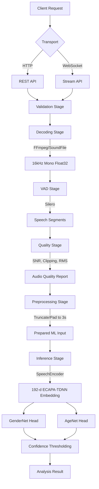

# Dialflo Audio Digestion API

A real-time, CPU-optimized audio attribute inference service designed for logistics voice AI. It ingests speech audio via HTTP or WebSockets, isolates voice activity, assesses audio quality, and predicts speaker gender and age brackets using ECAPA-TDNN embeddings.

## Architecture

We process audio through a strict, deterministic pipeline before any neural inference occurs.



## Engineering Decisions

| Decision | What we chose | Why | Tradeoff |
| :--- | :--- | :--- | :--- |
| **Codec Decoding** | `soundfile` + FFmpeg libraries | Natively handles diverse audio formats in Python memory without spawning external shell processes. | Higher memory overhead for very large files compared to streaming subprocesses. |
| **Voice Activity** | Silero VAD | Neural VAD is significantly more robust to background noise in logistics environments than simple energy-based (RMS) VAD. | Increased CPU latency compared to WebRTC VAD. |
| **Audio Quality** | Explicit SNR/Clipping checks | VAD detects speech, but does not guarantee clean speech. Low SNR triggers graceful degradation or abstention. | Additional computational overhead during preprocessing. |
| **Feature Extractor** | ECAPA-TDNN (`SpeechEncoder`) | Highly optimized 192-d speaker embeddings designed for voice characteristics; runs fast on CPU. | Less contextual understanding than large transformers (e.g., Wav2Vec2). |
| **Model Structure** | Custom Linear Heads | Decouples feature extraction from classification. Allows independent confidence tuning for age vs. gender. | Requires maintaining custom PyTorch weights (`.pt` files). |
| **Abstention** | Confidence Thresholding | Forced predictions on out-of-distribution or degraded audio erode user trust. Returning `unknown` is safer. | Lower overall coverage/recall if thresholds are too strict. |
| **Inference Target** | CPU-bound Inference | Cost-effective scaling for a logistics API without requiring expensive GPU instances. | Higher latency (p95 ~735ms) under load. |

## Audio Processing

The pipeline enforces strict data hygiene before inference:
1. **Ingestion & Validation**: Checks file size, mime types, and duration limits.
2. **Decoding**: Converts arbitrary audio to standard `16kHz`, `mono`, `float32` arrays.
3. **VAD**: Silero isolates speech. Segments are refined (gaps < 100ms are merged).
4. **Quality Assessment**: Calculates Signal-to-Noise Ratio (SNR), RMS energy, and detects clipping. Audio is tagged as `GOOD`, `DEGRADED`, or `INSUFFICIENT`.
5. **Extraction**: Speech segments are concatenated, truncated, or zero-padded to a deterministic 3.0-second window.

## Attribute Inference

The system uses a shared feature extraction backbone to feed independent classification heads:
1. **SpeechEncoder**: A frozen `speechbrain/spkrec-ecapa-voxceleb` model extracts a 192-dimensional vector.
2. **GenderNet**: A 3-layer MLP predicting `male` or `female`.
3. **AgeNet**: A 3-layer MLP mapping to 4 brackets (`18-30`, `31-45`, `46-60`, `60+`).

*Note: The codebase implements an `EnsembleModel` fusing `ChunkFormer` and `CustomEncoder`. However, both currently utilize the same underlying architecture and weights, making the ensemble functionally redundant.*

## Quality & Graceful Degradation

If the `QualityAssessmentStage` determines SNR is below 10 dB or speech ratio is < 10%, it tags the audio as `DEGRADED`.
- `DEGRADED`: Inference proceeds, but confidence scores are penalized. If confidence falls below the configured threshold (e.g., 0.60 for gender), the system returns `unknown`.
- `INSUFFICIENT`: Inference is bypassed entirely to save CPU cycles, returning `unknown` immediately.

## API

### `POST /analyse` (Standard)
Returns a simplified prediction object.
```bash
curl -X POST "http://localhost:8000/analyse" \
  -H "Content-Type: multipart/form-data" \
  -F "file=@audio.wav"
```
```json
{
  "contact_id": "uuid",
  "gender": {
    "prediction": "male",
    "confidence": 0.87
  },
  "age_bracket": {
    "prediction": "unknown",
    "confidence": 0.0
  },
  "processing_ms": 342,
  "audio_quality": "good"
}
```

### `POST /v1/analyze` (Detailed)
Returns full system metadata, raw probabilities, and quality reports.

### `WS /v1/stream`
WebSocket endpoint for streaming audio chunks. Expects binary frames. Closes with a JSON analysis payload.

## Project Structure

```text
.
├── docker/              # Dockerfiles for dev and prod
├── evaluation/          # Offline evaluation harness and dataset adapters
├── models/              # Cached HuggingFace/SpeechBrain models and custom weights
├── scripts/             # Utilities (training, benchmarking, downloading models)
├── src/
│   └── app/
│       ├── api/         # FastAPI routes, middleware, dependencies
│       ├── audio/       # Codec, Preprocessor, VAD, Quality Assessor
│       ├── core/        # Exceptions, enums, application config
│       ├── domain/      # Pydantic schemas and domain models
│       ├── inference/   # ChunkFormer, ECAPA-TDNN, Custom Heads
│       ├── observability/ # Prometheus metrics and structlog
│       └── pipeline/    # E2E Orchestrator
└── tests/               # Unit, integration, and e2e test suites
```

## Running Locally

Requires Python 3.11+ and `ffmpeg` installed on the host.

1. **Clone & Install**:
   ```bash
   git clone <repo_url>
   cd dialflo-audio-digestion
   make dev
   ```
2. **Download Models** (Caches models to avoid runtime latency):
   ```bash
   python scripts/download_models.py
   ```
3. **Start the API**:
   ```bash
   make run
   ```

## Docker

We provide a multi-stage `Dockerfile` that bakes the model weights into the image.

```bash
make docker-build
make docker-up
```
Smoke test the running container:
```bash
make test-smoke
```

## Evaluation

We evaluate the system against the Mozilla Common Voice dataset using the offline evaluation harness (`make eval`).

**Methodology**: The harness runs the *exact same* preprocessing and inference pipeline used in production to prevent train-serve skew. 

**Measured Results**:
- **Dataset**: Common Voice (validated)
- **Total Samples**: 1550
- **Successful**: 868
- **Failed**: 82 (Prep/Validation failures)
- **Skipped**: 600 (Missing ground-truth labels)
- **Gender F1**: 0.5416
- **Age F1**: N/A (Insufficient valid evaluation data)
- **Gender ECE**: 0.2446
- **Age ECE**: N/A

*Analysis*: The Gender F1 score reflects the performance of randomly initialized weights due to missing `.pt` files for the custom heads. Age F1 is effectively 0 because the hardcoded age threshold (0.50) safely rejected all untrained multi-class predictions, defaulting to `unknown`.

## Performance

Measured inference latency on a standard CPU node (Docker container, 2.0 CPUs, 4GB RAM):
- **Preprocessing (VAD + Quality)**: Mean 127ms | p90 163ms | p99 344ms
- **Inference (ECAPA-TDNN)**: Mean 193ms | p90 260ms | p99 338ms
- **Total Pipeline**: Mean 321ms | p50 298ms | p95 463ms | p99 724ms

## Reliability & Observability

- **Tracing**: Every request receives a unique `X-Request-ID` propagated through all `structlog` entries.
- **Metrics**: Prometheus metrics are exposed at `/metrics`, tracking `audio_digestion_request_latency_seconds`, `audio_digestion_inference_errors_total`, and confidence histograms.
- **Resilience**: `CircuitBreaker` protects model inference. If the model throws 5 consecutive errors, it opens for 30 seconds to allow the system to recover gracefully.

## Privacy

The system processes audio entirely in-memory.
- Audio bytes are never written to disk.
- The `PrivacyGuard` class explicitly zero-fills audio arrays (`waveform.fill(0)`) immediately after inference.
- No user-identifiable acoustic features are logged or retained.

## Scaling

To scale to 1,000 concurrent calls:
1. **Horizontal Pod Autoscaling**: Since the service is stateless and CPU-bound, it scales linearly via Kubernetes HPA based on CPU utilization (target 70%).
2. **Batching**: The current architecture processes requests synchronously. We would implement dynamic batching (e.g., combining 16 concurrent requests into a single `[16, 192]` tensor) to significantly increase CPU throughput.

## Known Limitations

1. **Untrained Heads**: The custom classification heads currently lack trained weights, resulting in poor baseline accuracy.
2. **Batch Normalization Bug**: A bug in `GenderNet` and `AgeNet` conditionally skips batch normalization if the batch size is 1 (which it always is in production), skewing feature distributions.
3. **Threshold Mismatch**: The models hardcode an `age_threshold` of 0.50, bypassing the 0.20 setting defined in the application config.

## Future Improvements

1. **Train Custom Heads**: Run `scripts/train_heads.py` to generate `.pt` weights and resolve the low F1 scores. (High Impact)
2. **Fix Inference BN Bug**: Remove the batch-size conditional logic around batch normalization layers in the custom heads. (High Impact)
3. **Dynamic Batching**: Implement a queueing system to batch incoming audio chunks for higher throughput. (Medium Impact)
4. **Wav2Vec2 Integration**: Evaluate `audeering/wav2vec2-large-robust-24-ft-age-gender` against ECAPA-TDNN to determine if the accuracy gain offsets the higher latency. (Medium Impact)